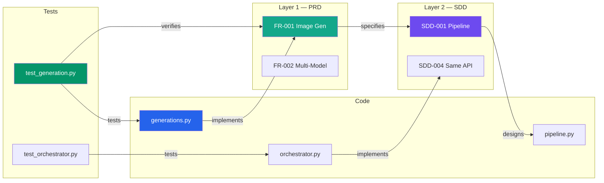

# RWANG / doc-graph — Document Graph, DAG & Symlinks

Build and maintain a living knowledge graph that connects documentation ↔ requirements ↔ code. Track change propagation with a Directed Acyclic Graph (DAG). Manage doc-code symlinks through structured annotations.

## When This Skill Activates

- User asks to "build doc graph", "update graph", "show doc relationships"
- User asks about "doc-code links", "traceability", "what depends on what"
- User asks to "scan annotations", "check drift", "what's stale"
- User runs `/rwang:doc-graph`
- After `rwang:doc-architect` scaffolds a new project
- After significant code or doc changes

## Core Concepts

### Document Graph

A knowledge graph stored in `docs/.doc-graph.json` with:

**Node types**:
| Type | Example | ID Format |
|------|---------|-----------|
| `document` | PRD-SDD-v2.0.md | `doc:<filename>` |
| `section` | §5.5 AI Agent Capabilities | `sec:<doc>:<section-id>` |
| `requirement` | FR-001 Image Generation | `req:<ID>` |
| `code_file` | backend/app/ai/agents/orchestrator.py | `code:<path>` |
| `component` | AgentOrchestrator class | `comp:<module>:<name>` |
| `test` | test_orchestrator.py | `test:<path>` |
| `api_endpoint` | POST /v1/generations | `api:<method>:<path>` |
| `db_table` | generations | `db:<table>` |

**Edge types**:
| Edge | From → To | Meaning |
|------|-----------|---------|
| `specifies` | requirement → section | Requirement is specified in this section |
| `implements` | code_file → requirement | Code implements this requirement |
| `designs` | section → component | Section designs this component |
| `tests` | test → code_file | Test covers this code |
| `verifies` | test → requirement | Test verifies this requirement |
| `depends_on` | component → component | Runtime dependency |
| `references` | document → document | Cross-document reference |
| `exposes` | code_file → api_endpoint | Code defines this endpoint |
| `persists_to` | component → db_table | Component writes to this table |
| `contradicts` | node → node | Conflicting information (flagged) |
| `stale` | node → node | Source changed, target not updated |

### Change DAG

A Directed Acyclic Graph overlaid on the document graph that tracks change propagation:

```
When a node changes → all downstream edges are marked "potentially stale"
```

**Propagation rules**:
```
requirement changes → flag: sections that specify it
                    → flag: code that implements it
                    → flag: tests that verify it

code changes        → flag: docs that describe it
                    → flag: tests that cover it

section changes     → flag: requirements it specifies (for contradiction check)
                    → flag: components it designs (for drift check)
```

**Depth limit**: Propagation stops after 3 hops to avoid flag storms.

### Doc-Code Symlinks

Structured annotations in code that create bidirectional links:

**Annotation format** (in comments):
```python
# @req FR-001, FR-002 — implements image generation pipeline
# @spec SDD-004 — agents use same pipeline API as UI
# @designs §5.5 — AI Agent Capabilities section
# @tested test_generation.py::test_basic_generation
```

```typescript
// @req FR-001, FR-002 — implements image generation pipeline
// @spec SDD-004 — agents use same pipeline API as UI
// @designs §5.5 — AI Agent Capabilities section
// @tested __tests__/generation.test.ts
```

**Annotation types**:
| Annotation | Meaning | Links To |
|------------|---------|----------|
| `@req <ID>` | This code implements requirement <ID> | requirement node |
| `@spec <ID>` | This code follows design decision <ID> | requirement/section node |
| `@designs <section>` | This code is designed in <section> | section node |
| `@tested <file>` | This code is tested by <file> | test node |

## Process

### Step 1: Scan Documents

Read all files in `docs/` and extract:

1. **Document metadata**: title, version, last-updated, path
2. **Sections**: heading hierarchy with IDs
3. **Requirement IDs**: all FR-xxx, NFR-xxx, SDD-xxx, etc.
4. **Cross-references**: links to other docs, sections, requirements
5. **Diagrams**: Mermaid diagram content (component names, flows)
6. **API endpoints**: mentioned in API docs
7. **DB tables**: mentioned in schema docs

### Step 2: Scan Code

Scan source files for:

1. **Structured annotations**: @req, @spec, @designs, @tested
2. **Unstructured references**: plain comments like `# FR-013`, `// implements SDD-004`
3. **Class/function definitions**: to build component nodes
4. **Route definitions**: to build api_endpoint nodes
5. **Model definitions**: to build db_table nodes
6. **Import graph**: to build depends_on edges
7. **Test files**: to build test nodes and verifies edges

**Scan commands**:
```bash
# Structured annotations
grep -rn "@req\|@spec\|@designs\|@tested" \
  --include="*.ts" --include="*.tsx" --include="*.py" \
  --include="*.go" --include="*.java" --include="*.rs" \
  src/ app/ backend/ frontend/

# Unstructured requirement references
grep -rn "FR-[0-9]\|NFR-[0-9]\|SDD-[0-9]\|SEC-[0-9]\|AI-AGT-[0-9]\|AI-ETH-[0-9]" \
  --include="*.ts" --include="*.tsx" --include="*.py" \
  src/ app/ backend/ frontend/

# Route definitions (Python/FastAPI)
grep -rn "@router\.\(get\|post\|put\|delete\|patch\)" \
  --include="*.py" backend/

# Route definitions (Next.js)
find frontend/src/app -name "route.ts" -o -name "route.js"

# Model definitions (SQLAlchemy)
grep -rn "class.*Base)" --include="*.py" backend/app/models/

# Test files
find . -name "test_*.py" -o -name "*.test.ts" -o -name "*.spec.ts"
```

### Step 3: Build Graph

Construct the graph by:

1. Create nodes for all discovered entities
2. Create edges based on:
   - Annotation links (@req → requirement)
   - Code references (comment mentions → requirement)
   - Import graph (file A imports from file B → depends_on)
   - Test coverage (test file imports module → tests)
   - API docs ↔ route definitions
   - DB schema docs ↔ model definitions
3. Compute content hashes for change detection

### Step 4: Detect Drift

Compare current graph against the previous version (if exists):

```
For each node:
  current_hash = hash(current file content)
  stored_hash  = node.hash from .doc-graph.json

  if current_hash != stored_hash:
    mark node as CHANGED
    propagate staleness to downstream nodes (up to 3 hops)
```

### Step 5: Generate Outputs

#### 5a. Updated `docs/.doc-graph.json`

```json
{
  "version": "1.0.0",
  "generated_by": "rwang:doc-graph",
  "generated_at": "2026-08-08T12:00:00Z",
  "stats": {
    "total_nodes": 142,
    "total_edges": 387,
    "stale_edges": 5,
    "contradiction_edges": 0,
    "coverage": {
      "requirements_with_code": "95%",
      "requirements_with_tests": "78%",
      "code_with_docs": "62%"
    }
  },
  "nodes": [
    {
      "id": "req:FR-001",
      "type": "requirement",
      "label": "Image Generation",
      "defined_in": "docs/PRD-SDD-v2.0.md",
      "section": "§5.1",
      "hash": "a1b2c3d4",
      "status": "current",
      "last_verified": "2026-08-08T12:00:00Z"
    },
    {
      "id": "code:backend/app/api/generations.py",
      "type": "code_file",
      "label": "generations.py",
      "hash": "e5f6g7h8",
      "status": "changed",
      "last_verified": "2026-08-01T00:00:00Z",
      "annotations": {
        "@req": ["FR-001", "FR-002"],
        "@spec": ["SDD-001"]
      }
    }
  ],
  "edges": [
    {
      "from": "code:backend/app/api/generations.py",
      "to": "req:FR-001",
      "type": "implements",
      "status": "current",
      "source": "annotation"
    },
    {
      "from": "code:backend/app/api/generations.py",
      "to": "doc:PRD-SDD-v2.0",
      "type": "stale",
      "status": "stale",
      "reason": "code changed 2026-08-05, doc last updated 2026-07-20",
      "source": "dag-propagation"
    }
  ]
}
```

#### 5b. Traceability Matrix (auto-generated)

Generate `docs/appendices/D-traceability.md`:

```markdown
# Appendix D — Traceability Matrix

*Auto-generated by RWANG doc-graph on 2026-08-08*

| Req ID | Title | Defined In | Implemented By | Tested By | Status |
|--------|-------|------------|----------------|-----------|--------|
| FR-001 | Image Generation | §5.1 | generations.py, pipeline.py | test_generation.py | ✅ Current |
| FR-002 | Multi-Model Support | §5.1 | model_selector.py | test_model_selector.py | ✅ Current |
| FR-003 | Prompt Control | §5.1 | — | — | 🔴 Not Implemented |
| AI-AGT-001 | Prompt Enhancer | §19 | prompt_enhancer.py | test_prompt_enhancer.py | 🟠 Stale |
```

#### 5c. Visual Graph (Mermaid)

Generate a Mermaid diagram showing the graph structure:



#### 5d. Coverage Report

```markdown
## Doc-Code Coverage

| Metric | Value | Target |
|--------|-------|--------|
| Requirements with code refs | 95% (114/120) | 100% |
| Requirements with test refs | 78% (94/120) | 90% |
| Code files with doc refs | 62% (43/69) | 80% |
| Structured annotations (@req) | 0% (0/69) | 50%+ |
| Unstructured refs (# FR-xxx) | 89% (62/69) | — |

### Gaps

**Requirements not yet implemented** (6):
- FR-003, FR-017, FR-022, NFR-008, NFR-012, BR-005

**Code files with no doc references** (26):
- frontend/src/components/ui/button.tsx
- frontend/src/components/ui/input.tsx
- ... (list all)
```

## Annotation Migration Guide

If the project has unstructured references (comments like `# FR-013`) but no structured annotations, offer to help migrate:

```markdown
## Migration Opportunity

Found 293 unstructured requirement references across 69 files.
Found 0 structured annotations (@req, @spec, @designs, @tested).

### Example migration:

**Before** (unstructured):
```python
# FR-001: Image generation endpoint
@router.post("/v1/generations")
async def create_generation(...):
```

**After** (structured):
```python
# @req FR-001 — Image generation endpoint
# @spec SDD-001 — Uses pipeline node registry
# @designs §5.1
# @tested test_generation.py::test_create_generation
@router.post("/v1/generations")
async def create_generation(...):
```

Want me to generate a migration script?
```

## Git Hook Integration

This skill generates drift detection data that the RWANG git hook can use. After updating the graph, check if `hooks/hooks.json` is installed and remind the user if not:

```markdown
💡 **Tip**: Install the RWANG git hook to auto-detect drift on every commit:
The hook compares changed files against the doc graph and warns if
documentation may need updating.
```

## Important Rules

- **Always update the hash** — every node gets a fresh content hash on each scan
- **Preserve manual edges** — if someone manually added an edge (source: "manual"), don't delete it
- **3-hop propagation limit** — DAG staleness propagation stops after 3 edges to avoid noise
- **Don't auto-fix** — report drift and staleness, let the user decide what to update
- **Incremental updates** — if .doc-graph.json exists, update it; don't rebuild from scratch unless asked
- **Respect .gitignore** — don't scan node_modules, __pycache__, .venv, etc.
- **Generate the traceability matrix** — always produce/update appendix D after a full scan
- **Bilingual** — respond in user's language; keep node IDs and technical terms in English
